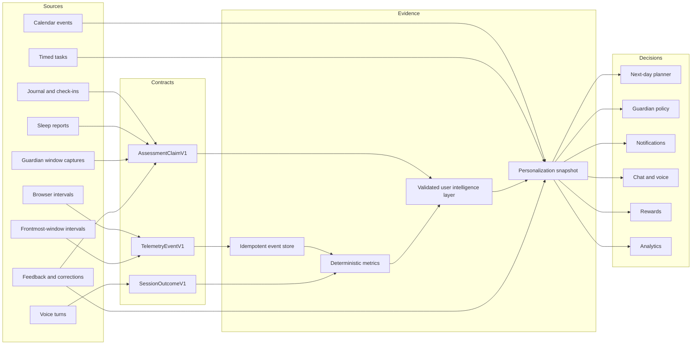

# LifeOS Decision Data Lineage

The target architecture separates observations, deterministic facts,
assessment claims, and decisions. A generative model may explain evidence, but
it must not silently promote an observation into a user fact.

## Required Boundaries

1. Source payloads carry device, source, event ID, observed interval, privacy
   decision, and provenance.
2. Duplicate event IDs are accepted idempotently and never count twice.
3. Raw screenshots and audio are deleted immediately after inference.
4. Unknown, malformed, expired, or unsupported claims cannot affect decisions.
5. Deterministic metrics are authoritative; model prose is explanatory.
6. User corrections supersede model claims and propagate through the shared
   snapshot.
7. Every decision records the evidence references and snapshot version it used.

## Capture Policy

| Context | Browser/app metadata | Screenshot | Audio |
| --- | --- | --- | --- |
| Outside waking hours | Off | Off | User initiated only |
| Waking hours, no focus session | Low-detail intervals | Off | User initiated only |
| Active Guardian focus session | Goal-aware intervals | Frontmost window, privacy-filtered | User initiated or explicit realtime session |
| Locked or asleep | Locked state only | Off | Off |

Existing tab groups are user-owned. LifeOS may group a tab only when LifeOS
opened it or when session relevance is at least 0.85, and it must never move an
already-grouped tab automatically.
